# Elixir Money

## Architecture

```mermaid
sequenceDiagram
participant Magnus as Magnus (Sender)
participant Server as Server
participant Opus as Opus (Receiver)

Magnus->>Server: Deposits £10
Server-->>Magnus: Converts to $13.05 USDC
Magnus->>Server: Create send request for R230
Server-->>Magnus: Shows quote in USDC + GBP
Magnus->>Opus: Sends $13.05 USDC via blockchain
Opus->>Server: Withdraw funds
Server-->>Opus: Convert to R228.54
```



[//]: # (TODO: Do we want withdraw step above? Or is it better to be simpler?)

## Dependencies

### Pre-commit hooks

1. Assuming you have `pip`, install pre-commit with:
```shell
pip install pre-commit
```
2. Install the pre-commit config (./pre-commit-config.yaml) with:
```shell
pre-commit install
```
3. Test run against all files with:
```shell
pre-commit run --all-files
```

### Encore

Encore is a Development Platform for cloud backend applications. It simplifies the development and deployment processes.

```shell
brew install encoredev/tap/encore
```

See https://encore.dev/docs for more info.

#### Envs

Encore has four types of environments:

1. production
2. development
3. preview
4. local

5. Some environment types differ in how infrastructure is provisioned:

- `preview` environments are provisioned in Encore Cloud and are optimized to be cost-efficient and fast to provision.
- `local` is provisioned by Encore's CLI using local versions of infrastructure.
Aside from determining infrastructure, environment type is also used for Secrets management.

### Task

Task is used to list and run common development commands.

Install:
```shell
brew install go-task/tap/go-task
```

For other installation methods, see https://taskfile.dev/installation/

The Taskfile.yaml lists the commands available.
For example, you can run this command to run the task declared in that file called `gen`:
```shell
task gen
```

## Running locally

Before running the application, make sure you have synced the project dependencies by running `go mod tidy` and that Docker is
installed and running. Docker is required when running Encore applications locally that uses SQL databases.

To start the Encore application, run:

```bash
encore run
```

While `encore run` is running, open [http://localhost:9400/](http://localhost:9400/) to view Encore's [local developer dashboard](https://encore.dev/docs/observability/dev-dash).

## Tests

### Running
Since Encore tests can't be run with the regular test command, you will need to run tests with:
```shell
task test
```
or from a given service directory, if you only want to run those tests:
```shell
cd users
encore test
```

## Debugging

### Debugging

To debug the app, you'll need to first run Encore in debug mode:
```shell
encore run --debug
```

Then go on `Run | Attach to Process` in GoLand, and select the process ID output form the encore run command.
(If a notification window appears, click the Invoke `go get gops link)

See https://encore.dev/docs/how-to/debug for more info.

### Connection String

#### Get Local
```shell
encore db conn-uri users --env=local
```

### Shell

#### Open DB Shell

To open users DB, local:
```shell
encore db shell users --env=local
```

#### Re-running a migration
After opening a shell in the DB, run:
```shell
UPDATE schema_migrations SET version = version - 1;
```

### Generating store code with `sqlc`

In order to generate code in `store` package you should have installed [sqlc](https://docs.sqlc.dev/en/stable/) and create your SQL queries in `store/queries` directory.
Then just run this command from root catalog.

```shell
sqlc generate
```

Or you can run this task command to generate all:
```shell
task sqlc-gen
```

## Encore
### Open the developer dashboard

While `encore run` is running, open [http://localhost:9400/](http://localhost:9400/) to view Encore's [local development dashboard](https://encore.dev/docs/observability/dev-dash). Here you can see the request you just made and view a trace of the response.

### Setting secrets
Specify a secret:
```shell
encore secret set --type dev,local,pr MySecretName
```
or
```shell
encore secret set --type prod MySecretName
```
Then enter secret in.

View secrets with:
```shell
encore secrets list
```
and then a specific one with:
```shell
encore secrets list secretNameFromCallAbove
```
(secret _values_ have to be viewed from Encore settings)

### GoLand Plugin

https://plugins.jetbrains.com/plugin/20010-encore

- Can type `newapi` to generate a new API endpoint

## Deployment

Deployments are synced with the GitHub repo, so when new commits are pushed to main, they will be auto-deployed.
See the CI checks against the commits on the main branch to see if they succeeded.

Head over to the [Cloud Dashboard](https://app.encore.dev) to monitor your deployment and find your production URL.

From there you can also connect your own AWS or GCP account to use for deployment.
